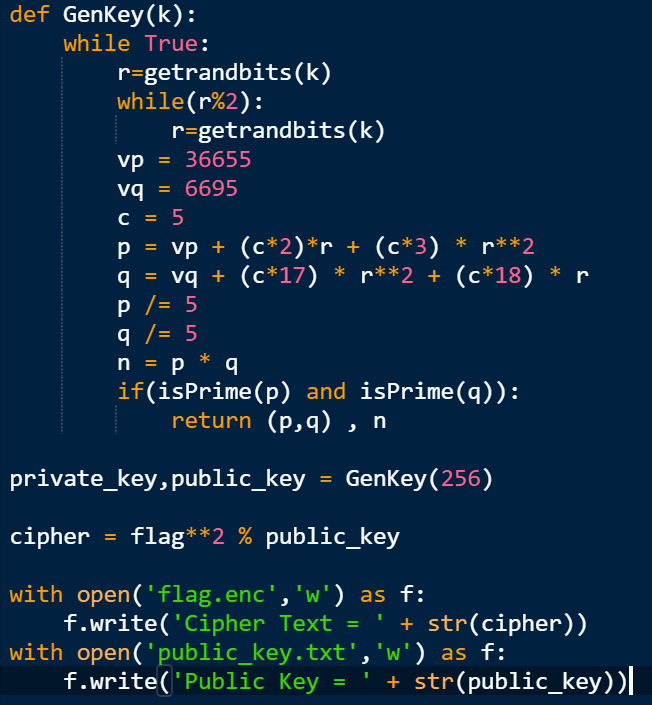
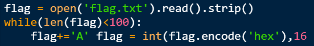

 # Category
Cryptography

# file
[Robin.zip](https://github.com/AyoubAref/CTF-writeups/blob/master/HC%20CTF/Robin.zip)

# Solution
This is a write-up on how I solved Robin from HC CTF.

There are 3 files given in this challenge:

1. encripted text (flag.enc).

2. public key (public_key.txt).

3. python script (Robin.py) wich generates the flag and the public key.

At the beginning we have to read the python script to understand how the message was encrypted.

In the code above, the public key and the cipher text was generated.

GenKey function returns the value of n, where n = p*q and p and q are prime numbers.

so :

public_key = n

n = p*q

cipher_text ≡ flag² (mod n)

Let's figure out the value of p and q

p = (36655 + 10r + 15r²)/5

= 7331 + 2r + 3r²
  

q = (6695 + 90r + 85r²)/5

= 1339 + 18r + 17r²
  

n = p*q
= (1339 + 18r + 17r²) * (7331 + 2r + 3r²)

= 9816209 + 2678r + 4017r² + 131958r + 36r² + 54r³ + 124627r² + 34r³ + 51(r*r³)

= 9816209 + 134636r + 128680r² + 88r³ + 51(r*r³)
  
n = public key = 7470857157955704803940003567468318902063888809719567376503613129007013716743925892450018252783386138850642972088591883052262361283298353312476212612525048118810465982103089375176761352934813149353517982950737995540502531426318532874440815137600167002633585531497402594289176138883080119116491271670468863018241

Now we want to figure out the value of r, becuase it's the only way to find the value of p and q.

I used a method called [bisection method](https://en.wikipedia.org/wiki/Bisection_method) (binary search) for finding the value of r, p and q.

code :
[Java](https://ideone.com/sMKy2X),
[Python](https://ideone.com/Xo3Vj3)

    for python :

	n = 9816209 + 134636r + 128680r² + 88r³ + 51(r*r³)

	n-9816209 = 134636r + 128680r² + 88r³ + 51(r*r³)

	(n-9816209)/r = 134636 + 128680r + 88r² + 51r³

Now we know the values of n,p,q and the cipher text , and we want to know the value of flag, wich is the square root of the cipher text modulo n.

So this challenge is a [Rabin cryptosystem](https://en.wikipedia.org/wiki/Rabin_cryptosystem) challenge 

Rabin cryptosystem decryption algorithm of runs as follow :

1. Let's define cipher text as 'c'

2. Compute the square root of c modulo p and q using these formulas:

       Mp = c**((p+1)/4) mod p
	
       Mq = c**((q+1)/4) mod q
	
	
##### Notice that always p+1 ≡ 0 (mod 4) and q+1 ≡ 0 (mod 4)

I used an algorithm called [modular exponentiation](https://en.wikipedia.org/wiki/Modular_exponentiation) To compute Mp and Mq as fast as possible (time complexity O(lg(p)+lg(q))).

code:
[Java](https://ideone.com/Aj5Abe),
[Python](https://ideone.com/Xr51sr)

3. Use the [extended Euclidean algorithm](https://en.wikipedia.org/wiki/Extended_Euclidean_algorithm) to find Yp and Yq such that Yp.p+Yq.q=1.

code: 
[Java](https://ideone.com/UXBVBz),
[Python](https://ideone.com/zvJ14c)

4. Use the [Chinese remainder theorem](https://en.wikipedia.org/wiki/Chinese_remainder_theorem) to find the four square roots of c modulo n:

	r1=(Yp.p.Mq+Yq.q.Mp) mod n
	
	r2=n-r1
	
	r3=(Yp.p.Mq-Yq.q.Mp) mod n
	
	r4=n-r2
	
And the flag is one of these roots

code:
[Java](https://ideone.com/4QJrrY),
[Python](https://ideone.com/wbZXAG)

Now we find out the square roots of c, so the last step is finding the flag.

We need to convert each square root from decimal to hexdecimal then convert each two digits of the result to character (using ascii code)
(This is the inverse method of the code below)

I used this website to convert the square root to hexdecimal, but you can write your own code.

https://www.rapidtables.com/convert/number/decimal-to-hex.html

after converting the number to hexdecimal, use this code to print the flag:

[Java](https://ideone.com/E3uGOU),
[python](https://ideone.com/tDHMIt)

I hope you enjoyed and learned :D
